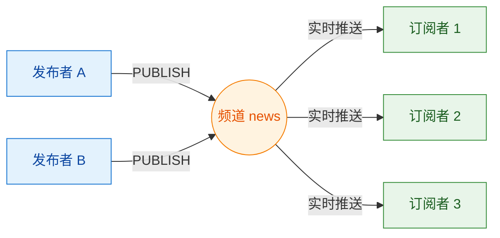
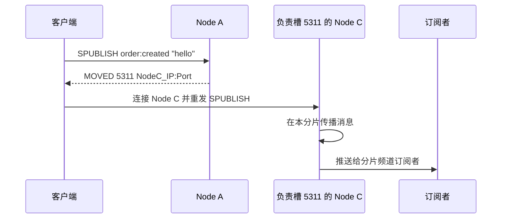

# Redis 发布订阅：Pub/Sub 与分片机制

Redis Pub/Sub 是一种轻量级的发布订阅机制：发布者把消息发送到频道，Redis 将消息实时推送给当前在线的订阅者。发布者和订阅者互不感知，但频道**不保存消息**，因此它适合实时广播，不适合可靠消息处理。

## 它如何工作



- 发布者只负责向频道发送消息；
- 订阅者只接收订阅成功后发布的消息；
- 一个频道可以有多个发布者和订阅者；
- 同一条消息会推送给所有当前在线且匹配的订阅者。

## 什么时候适合使用

适合：

- 在线通知、聊天室、弹幕和直播间广播；
- 缓存失效通知、配置变更通知；
- 允许偶尔丢失、无需回放的实时事件。

不适合：

- 消息不能丢失；
- 消费失败后需要重试；
- 消费者离线后需要补发；
- 需要消息积压、消费组或历史重放。

这些场景应优先考虑 Redis Streams 或专业消息队列。

## 最小用法

```bash
SUBSCRIBE news        # 精确订阅频道
PSUBSCRIBE news:*     # 按模式订阅多个频道
PUBLISH news "hello" # 发布消息
```

| 方式 | 命令 | 匹配规则 |
|------|------|----------|
| 普通订阅 | `SUBSCRIBE channel` | 精确匹配频道名 |
| 模式订阅 | `PSUBSCRIBE pattern` | 通过通配符匹配，如 `news:*` |

如果一个客户端既直接订阅频道，又通过一个或多个模式匹配该频道，同一条发布消息可能收到多次。

## 消息语义和使用边界

### 至多一次投递

Redis Pub/Sub 是 **at-most-once（至多一次）**：Redis 不持久化、不确认，也不会重试消息。订阅者断线、处理失败或网络异常时，消息会永久丢失。

### 不受逻辑数据库隔离

Pub/Sub 不属于 Redis 键空间，`SELECT` 不会隔离频道。在 `db10` 发布的消息，连接在 `db1` 的订阅者也能收到。需要隔离时，应在频道名中加入环境或业务前缀，例如 `prod:order`、`dev:order`。

### 订阅连接的命令限制

- RESP2：进入订阅状态后，只能执行少数 Pub/Sub 相关命令，工程中通常使用独立连接；
- RESP3：订阅状态下仍可执行普通 Redis 命令，但客户端库是否支持仍需确认。

### 慢订阅者

订阅者处理速度跟不上发布速度时，待发送消息会积压在客户端输出缓冲区。达到 `client-output-buffer-limit pubsub` 限制后，Redis 会断开该客户端。因此 Pub/Sub 不能代替带积压和消费确认能力的消息系统。

## 普通订阅和模式订阅的消息格式

使用 RESP2 时，消息表现为数组；RESP3 使用 Push 类型帧，但字段语义相同：

| 类型 | 消息格式 | 含义 |
|------|----------|------|
| `message` | `[message, channel, payload]` | 普通订阅收到消息 |
| `pmessage` | `[pmessage, pattern, channel, payload]` | 模式订阅收到消息 |

`pmessage` 会额外携带命中的订阅模式，因此可以区分消息来自哪个模式。

## Redis Cluster 为什么需要分片 Pub/Sub

普通 Pub/Sub 在 Redis Cluster 中需要把频道消息传播到整个集群。集群规模和消息量增大后，这会增加集群总线流量。

Redis 7.0 引入 Sharded Pub/Sub：频道使用与 Redis 键相同的哈希槽算法，只在负责该槽位的主节点及其副本组成的分片内传播。

```text
槽位 = CRC16(频道名或有效哈希标签) % 16384
```

Redis Cluster 一共有 16384 个槽位；频道名包含有效 `{...}` 哈希标签时，只使用标签内的内容计算槽位。

### 发布流程

以 `SPUBLISH order:created "hello"` 为例，`order:created` 对应槽位 `5311`：



支持 Redis Cluster 的客户端通常会自动处理 `MOVED` 重定向，业务代码不需要手动断开和重发。

### 普通与分片 Pub/Sub 对比

| 维度 | 普通 Pub/Sub | 分片 Pub/Sub |
|------|--------------|--------------|
| 命令 | `PUBLISH` / `SUBSCRIBE` / `PSUBSCRIBE` | `SPUBLISH` / `SSUBSCRIBE` |
| 传播范围 | 集群范围 | 频道槽位所属分片 |
| 模式订阅 | 支持 | 不支持分片模式订阅 |
| 主要用途 | 单机或较小规模集群 | 降低大型 Redis Cluster 的 Pub/Sub 总线流量 |

普通频道和分片频道使用不同命令与订阅机制，不能认为 `SUBSCRIBE foo` 会收到 `SPUBLISH foo` 的消息。

## 快速判断

> 只需要向当前在线客户端实时广播，而且允许丢消息，可以使用 Redis Pub/Sub；需要可靠投递、积压、确认、重试或回放，应使用 Redis Streams 或专业消息队列。Redis Cluster 中消息规模较大时，再考虑 Sharded Pub/Sub。
