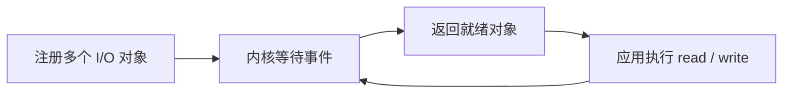
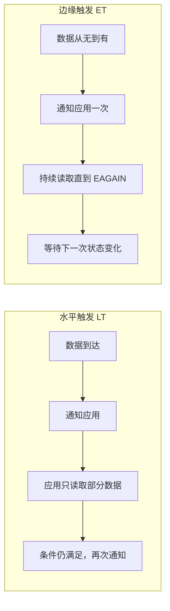

# I/O 多路复用：select、poll、epoll 与 kqueue 对比

`select`、`poll`、`epoll` 和 `kqueue` 都用于让一个线程等待多个 I/O 事件。核心差异是：`select`、`poll` 每次等待都要提交并扫描关注集合；`epoll`、`kqueue` 在内核中维护注册状态，等待时主要返回已触发的事件，更适合大量连接且活跃连接较少的场景。

## 它们解决什么问题

一个服务器可能同时维护成千上万个连接，但任意时刻通常只有部分连接可读或可写。I/O 多路复用把“等待哪些连接就绪”的工作交给内核：



这些接口提供的是 **I/O 就绪通知**，不负责业务处理，也不等同于完整的 Reactor 模式。

## 一张表看懂四者

| 维度 | select | poll | epoll | kqueue |
|------|--------|------|-------|--------|
| 主要平台 | POSIX，多平台 | POSIX，多平台 | Linux | BSD、macOS |
| 关注集合 | 每次传入 `fd_set` | 每次传入 `pollfd` 数组 | 内核维护 interest list | 内核维护注册的 filter |
| 返回方式 | 修改集合，应用遍历 | 填写 `revents`，应用遍历 | 返回就绪事件数组 | 返回已触发的 `kevent` 数组 |
| 查找就绪事件 | 通常遍历全部描述符 | 通常遍历全部描述符 | 主要处理 ready list | 主要处理已触发事件 |
| 数量限制 | 常受 `FD_SETSIZE` 限制 | 无 `FD_SETSIZE` 固定限制 | 受系统资源限制 | 受系统资源限制 |
| 触发方式 | 水平触发 | 水平触发 | LT、ET、one-shot | 默认状态式通知，`EV_CLEAR` 提供边缘式行为 |
| 事件范围 | 主要是描述符读写 | 主要是描述符读写 | 主要是描述符事件 | 还支持信号、定时器、进程、文件变化等 filter |

## 工作方式

### select：使用位图集合

1. 应用构造读、写和异常条件三个 `fd_set`；异常条件不等于普通 I/O 错误，例如可用于监听带外数据；
2. 每次调用都把集合交给内核；
3. 内核修改集合，只保留已就绪的描述符；
4. 应用遍历集合定位就绪项，下一轮重新构造集合。

优势是兼容性好；限制是集合大小、重复拷贝和线性扫描。

### poll：改用描述符数组

`poll` 使用 `pollfd` 数组，突破了 `select` 的固定集合大小；内核填写每个元素的 `revents`，应用仍要遍历整个数组查找就绪项，因此没有解决重复传入和线性扫描问题。

### epoll：注册和等待分离

```text
epoll_create  → 创建 epoll 实例
epoll_ctl     → 增删改关注的文件描述符
epoll_wait    → 获取已就绪事件
```

内核维护关注集合和就绪列表，应用无须每次重新提交全部描述符。`epoll` 支持水平触发（LT）、边缘触发（ET）和 one-shot。

### kqueue：通用事件过滤器

`kqueue` 创建事件队列，`kevent` 同时负责注册变更与等待事件。它不仅监听描述符读写，还能通过不同 filter 监听信号、定时器、进程和文件系统变化。

`kqueue` 和 `epoll` 都属于可扩展事件通知机制，但 API、事件模型和平台不同，不能简单认为两者完全等价。

## 水平触发与边缘触发



- **LT**：只要条件仍满足就继续通知，容错性高、编程简单。
- **ET**：通常只在状态变化时通知，应用必须配合非阻塞 I/O，并持续读写到 `EAGAIN`，否则可能遗漏处理机会。

ET 可以减少重复通知，但更容易写错；没有明确收益时，优先使用 LT。

## 选择建议

- 需要跨平台、连接较少：`select` 或 `poll` 已足够；
- Linux 上维护大量连接：通常优先 `epoll`；
- BSD 或 macOS：通常优先 `kqueue`；
- 应用开发：优先使用语言运行时或成熟网络库封装平台差异，而不是直接绑定底层接口。

## 常见误区

1. **epoll 不一定总比 poll 快**：连接较少，或者多数连接始终活跃时，优势可能不明显。
2. **非阻塞不等于异步**：非阻塞描述调用是否立即返回；异步通常强调操作完成后的通知与执行责任。
3. **I/O 多路复用不处理业务**：业务处理过慢仍会阻塞事件循环。
4. **ET 不是高级版 LT**：它只是通知语义不同，用复杂度换取潜在的通知开销下降。

