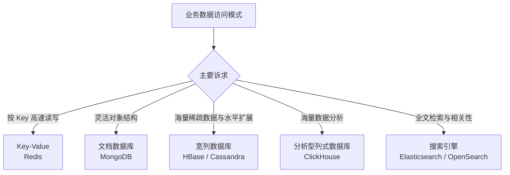
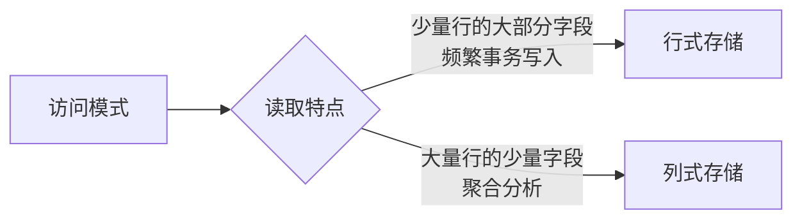
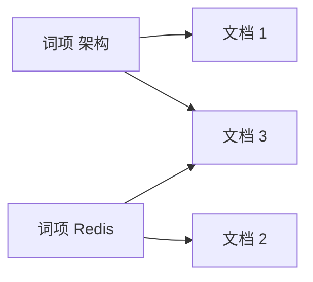

# NoSQL：类型与选型

NoSQL（Not Only SQL）是一组面向特定数据模型和访问模式的存储方案，用于补充关系型数据库在键值访问、灵活文档、海量分布式数据和全文检索等场景中的不足。它不是单一技术，也不是关系型数据库的统一替代品。

## 为什么关系型数据库不能覆盖所有场景

关系型数据库擅长结构化数据、关联查询和事务处理，但“通用”也意味着它不可能在所有场景中都最合适：

| 需求 | 关系型数据库可能遇到的问题 | 更匹配的方案 |
|------|----------------------------|--------------|
| 简单键值高频访问 | 通用 SQL、磁盘与索引路径可能成本较高 | Key-Value 数据库 |
| 字段频繁变化、嵌套对象 | 表结构变更与对象映射成本较高 | 文档数据库 |
| 海量稀疏数据、跨节点扩展 | 关系模型和单机存储不易水平扩展 | 宽列数据库 |
| 海量数据按少量列分析 | 行式读取会带入无关列 | 分析型列式数据库 |
| 任意文本组合与相关性搜索 | `LIKE '%关键词%'` 难以有效利用普通 B+ 树索引 | 全文搜索引擎 |

现代关系型数据库也支持在线 DDL、JSON、全文索引、分区和分布式部署。应从真实访问模式和瓶颈出发，而不是因为“Schema 固定”就直接改用 NoSQL。

## 按访问模式选择数据系统

下面的技术并非处于完全相同的分类层级：Key-Value、文档和宽列属于常见 NoSQL 数据模型；分析型列式数据库强调物理存储布局；全文搜索引擎则是面向检索的专用系统。把它们放在一起，是为了回答“这个数据访问模式适合什么系统”。

| 类型 | 数据模型 | 擅长场景 | 主要限制 |
|------|----------|----------|----------|
| Key-Value | Key → Value / 数据结构 | 缓存、计数、会话、排行榜 | 复杂关联与多条件查询能力有限 |
| 文档数据库 | JSON/BSON 文档 | 字段变化快、嵌套对象、内容系统 | 跨文档事务和 Join 能力因产品而异 |
| 宽列数据库 | 行键 + 列族 | 海量稀疏数据、水平扩展、高写入吞吐 | 建模依赖查询模式，临时查询困难 |
| 分析型列式数据库 | 按列组织数据 | OLAP、读取大量行中的少量列、聚合分析 | 不擅长高频单行事务更新 |
| 全文搜索引擎 | 文档 + 倒排索引 | 全文检索、日志搜索、聚合分析 | 通常不作为强事务业务的唯一事实存储 |

## 几个容易混淆的原理

### Redis 为什么被称为数据结构服务器

Redis 不只保存字符串，还原生支持 Hash、List、Set、Sorted Set、Stream 等结构，并提供针对这些结构的原子命令。它适合围绕 Key 的高频访问，但复杂关系查询不是其主要目标。

Redis 的 `MULTI/EXEC` 会按顺序执行命令队列，但默认不提供传统数据库式回滚；持久性取决于 RDB、AOF 和具体配置，不能简单概括为“只满足 ACID 中的某几项”。

### 文档数据库的 Schema 灵活性

文档自带字段名称和值，新文档可以增加字段，旧文档缺少该字段时由应用按默认值处理。这减少了统一改表的需要，但“灵活”不等于“不需要约束”，仍应通过应用校验或 Schema Validation 保证数据质量。

### 宽列不等于列式分析

- **宽列数据库**描述数据模型：按行键、列族和稀疏列组织数据，重点是水平扩展和分布式读写；
- **分析型列式数据库**描述物理存储布局：同一列的数据相邻，重点是少量列的大规模扫描、压缩和聚合；
- HBase、Cassandra 属于宽列数据库，ClickHouse 属于分析型列式数据库，不能因为名称都有“列”就混为一类。

### 行存与列存

行式存储适合 OLTP、整行读写和事务；列式存储适合读取大量行中的少量列，同类型数据连续排列也通常更容易压缩。

### 倒排索引

普通字段索引通常由**索引键定位记录**；全文搜索的倒排索引由**词项定位包含它的文档列表**：

全文搜索引擎还会进行分词、标准化、相关性评分和聚合，不只是保存“单词到文档”的映射。

## 选型时问什么

1. 最主要的访问方式是什么：按 Key、按条件、按关系、按文本还是按列聚合？
2. 是否需要跨记录强事务和复杂 Join？
3. 数据规模和写入吞吐是否需要水平扩展？
4. 能否接受最终一致性或产品特定的一致性模型？
5. 团队是否具备多种数据系统的监控、备份、恢复和同步能力？

NoSQL 产品差异很大，不能统一概括为“牺牲 ACID”。核心交易数据通常仍优先使用成熟关系型数据库，再用缓存、搜索和分析系统补充专用能力。

