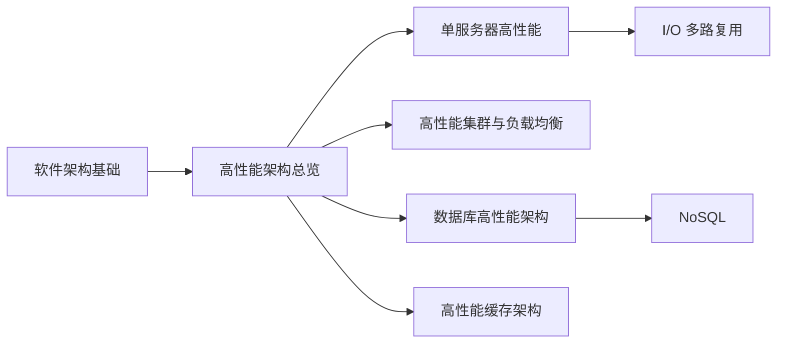

# 系统设计知识索引

## 学习路径

## 卡片列表

| 学习顺序 | 卡片 | 主要内容 |
|----------|------|----------|
| 1 | [软件架构基础：4R 与核心概念](./软件架构基础-4R与核心概念.md) | 系统、模块、组件、框架、架构、4R、架构设计目的 |
| 2 | [高性能架构：单机优化与集群扩展](./高性能架构-单机优化与集群扩展.md) | 高性能带来的复杂度、单机与集群两条路径 |
| 3 | [单服务器高性能架构：并发模型、Reactor 与 Proactor](./单服务器高性能架构-并发模型与Reactor-Proactor.md) | PPC、Prefork、TPC、资源池、I/O 多路复用、Reactor、Proactor |
| 4 | [I/O 多路复用：select、poll、epoll 与 kqueue 对比](./IO多路复用-select-poll-epoll-kqueue对比.md) | 四种接口、LT/ET、平台与选型 |
| 5 | [高性能集群：负载均衡层级与算法](./高性能集群-负载均衡层级与算法.md) | DNS、硬件、四层、七层负载均衡及调度算法 |
| 6 | [数据库高性能架构：读写分离与分库分表](./数据库高性能架构-读写分离与分库分表.md) | 主从复制、复制延迟、路由、垂直/水平拆分 |
| 7 | [NoSQL：类型与选型](./NoSQL类型与选型.md) | Key-Value、文档、宽列，以及相关的列式分析与全文搜索系统 |
| 8 | [高性能缓存架构：穿透、击穿、雪崩、热点 Key 与大 Key](./高性能缓存架构-穿透击穿雪崩与热点Key大Key.md) | Cache Aside、缓存异常、逻辑过期、后台刷新、热点 Key、大 Key、一致性 |

## 关键词索引

| 关键词 | 所在卡片 |
|--------|----------|
| 系统、子系统、模块、组件、框架、4R | [软件架构基础](./软件架构基础-4R与核心概念.md) |
| 高性能复杂度、任务分配、任务分解、SMP、NUMA、MPP | [高性能架构总览](./高性能架构-单机优化与集群扩展.md) |
| PPC、Prefork、TPC、Reactor、Proactor、IOCP、Acceptor、Completion Handler | [单服务器高性能架构](./单服务器高性能架构-并发模型与Reactor-Proactor.md) |
| select、poll、epoll、kqueue、水平触发、边缘触发 | [I/O 多路复用对比](./IO多路复用-select-poll-epoll-kqueue对比.md) |
| DNS、F5、A10、Nginx、LVS、轮询、最少连接、哈希 | [负载均衡层级与算法](./高性能集群-负载均衡层级与算法.md) |
| 读写分离、主从复制、主备、复制延迟、分库分表、垂直分表、水平分表 | [数据库高性能架构](./数据库高性能架构-读写分离与分库分表.md) |
| Redis、文档数据库、宽列数据库、分析型列式数据库、行式存储、倒排索引 | [NoSQL 类型与选型](./NoSQL类型与选型.md) |
| Cache Aside、缓存穿透、缓存击穿、缓存雪崩、逻辑过期、后台刷新、热点 Key、大 Key、缓存一致性 | [高性能缓存架构](./高性能缓存架构-穿透击穿雪崩与热点Key大Key.md) |
