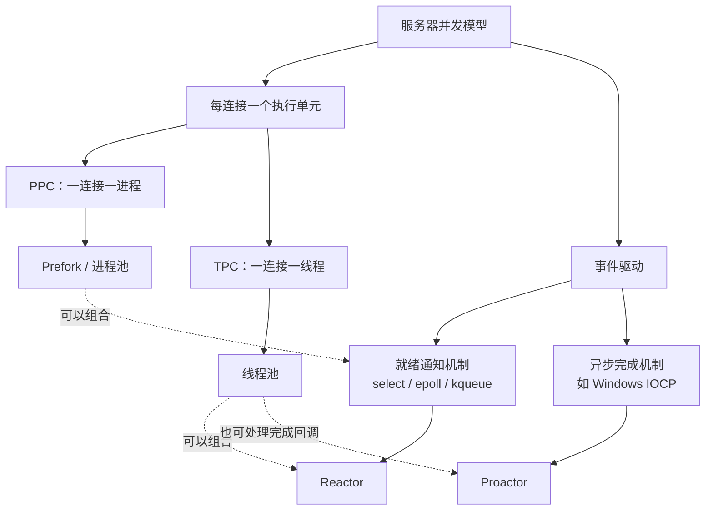
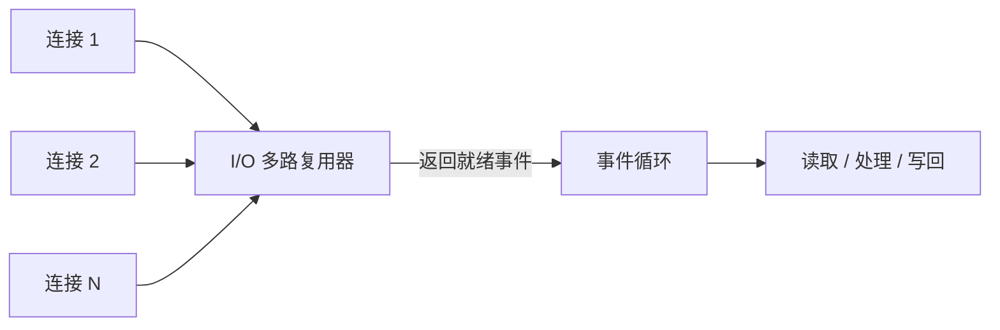
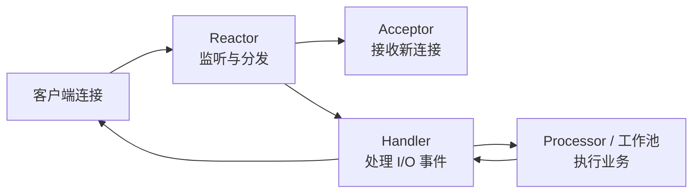
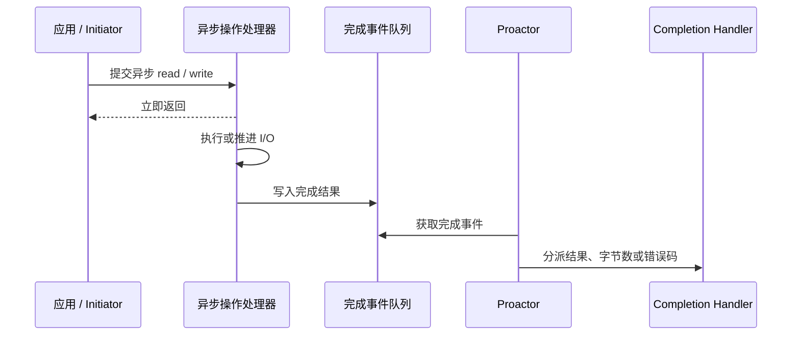

# 单服务器高性能架构：并发模型、Reactor 与 Proactor

单服务器高性能设计主要回答两个问题：**怎样管理大量连接，以及怎样高效处理请求**。连接规模、业务耗时、操作系统 I/O 能力不同，适合的并发模型也不同；Reactor 关注“就绪后由应用执行 I/O”，Proactor 关注“异步 I/O 完成后通知应用”，二者并不存在适用于所有场景的绝对优劣。

## 先判断任务类型

- **I/O 密集型**：大部分时间在等待网络、磁盘或下游响应，重点是减少阻塞并提高连接管理效率。
- **CPU 密集型**：大部分时间在计算，重点是利用多核并限制任务并发，避免事件循环被长时间占用。
- **混合型**：用事件循环处理网络 I/O，再把耗时计算交给工作进程或线程池。

最终性能还受到算法、锁竞争、内存分配、网络带宽和下游系统的共同影响。

## 常见并发模型

| 模型 | 工作方式 | 优点 | 主要限制 |
|------|----------|------|----------|
| PPC | 每个连接创建一个进程 | 隔离性好、实现直观 | 创建和切换成本高，并发连接受限 |
| Prefork | 预先创建工作进程并复用 | 减少临时 fork 的开销 | 仍受进程数量和通信成本限制 |
| TPC | 每个连接创建一个线程 | 创建成本较低，共享数据方便 | 栈内存、上下文切换、锁竞争和故障隔离 |
| 进程池 / 线程池 | 固定数量的执行单元处理任务 | 控制资源上限，避免频繁创建 | 阻塞或慢任务可能占满资源池 |
| 事件驱动 | 少量线程管理大量连接 | 适合高并发 I/O | 状态机、回调和异步错误处理更复杂 |

TPC 一般指 Thread Per Connection。线程中的未处理错误是否导致整个进程退出，取决于语言运行时和错误类型，不能一概而论。

## 为什么需要 I/O 多路复用

如果让每个连接独占一个线程，大量空闲连接也会持续占用线程资源；如果一个线程不断轮询多个非阻塞连接，又会浪费 CPU。

I/O 多路复用允许线程在一个等待点上监听多个文件描述符，只处理已经就绪的连接：

Linux 常见接口包括 `select`、`poll`、`epoll`，BSD/macOS 常见 `kqueue`。详细区别见 [I/O 多路复用：select、poll、epoll 与 kqueue 对比](./IO多路复用-select-poll-epoll-kqueue对比.md)。

I/O 多路复用优化的是“等待大量 I/O”，不会自动加速耗时的业务计算。

## Reactor 如何组织事件处理

Reactor 是建立在事件通知机制之上的设计模式，将事件监听、分发和业务处理分离：

### 三种常见组织方式

| 模型 | 如何工作 | 适合什么场景 | 主要限制 |
|------|----------|--------------|----------|
| 单 Reactor 单线程 | I/O 与业务处理都在一个线程 | 单次处理很快、逻辑简单 | 无法充分利用多核，慢任务会阻塞事件循环 |
| 单 Reactor 多线程 | Reactor 管 I/O，工作线程处理业务 | 业务处理较耗时 | 单 Reactor 仍可能成为连接和 I/O 瓶颈 |
| 主从 Reactor 多线程 | 主 Reactor 接收连接，子 Reactor 管 I/O，工作池执行业务 | 高并发、多核服务器 | 实现、调试和线程协作更复杂 |

单 Reactor 单线程并非不能处理高并发。当所有操作都是非阻塞的，而且单次处理很快时，它也能支持大量连接；Redis、Node.js 等都体现了事件循环模型的价值。

## Proactor 如何组织异步完成事件

Proactor 面向真正的异步操作：应用先提交读写请求，操作系统或异步操作处理器负责推进 I/O；操作完成后，完成事件进入队列，Proactor 再调用对应的 Completion Handler。

### Reactor 与 Proactor 的核心区别

| 维度 | Reactor | Proactor |
|------|---------|----------|
| 通知语义 | 文件描述符已经就绪 | 异步操作已经完成 |
| 谁执行实际 I/O | 应用收到就绪通知后调用 `read` / `write` | 操作系统或异步操作处理器 |
| 应用处理什么 | 可读、可写等就绪事件 | 完成结果、传输字节数和错误码 |
| 典型底层机制 | `select`、`poll`、`epoll`、`kqueue` | Windows Overlapped I/O / IOCP |
| 主要难点 | 非阻塞状态机、必须及时读写 | 缓冲区生命周期、完成回调与异步控制流 |

Boost.Asio 等库可以在不同平台上向应用提供统一的 Proactor 编程模型：Windows 上可直接使用 IOCP；Linux、BSD/macOS 上则可先由 `epoll` / `kqueue` 等 Reactor 机制等待就绪，再由库执行非阻塞 I/O，并把结果包装成“操作完成”事件。因此，**上层采用 Proactor 风格 API，不代表底层一定具有原生的完成式异步 I/O**。

## 怎么选

| 场景 | 优先考虑 |
|------|----------|
| 连接少、隔离要求高 | PPC / Prefork |
| 连接数量可控、开发简单优先 | TPC / 线程池 |
| 大量长连接、I/O 密集，底层提供就绪通知 | I/O 多路复用 + Reactor |
| 平台或框架提供异步完成接口 | Proactor 风格；Windows 常见 IOCP，跨平台库可封装底层差异 |
| CPU 密集型任务 | 多进程或工作线程池，避免阻塞事件循环 |

选择后必须通过压测验证，同时观察吞吐量、P95/P99 延迟、错误率、CPU、内存和线程切换。线程或连接越多不一定越快，下游容量也可能比本机更早成为瓶颈。

