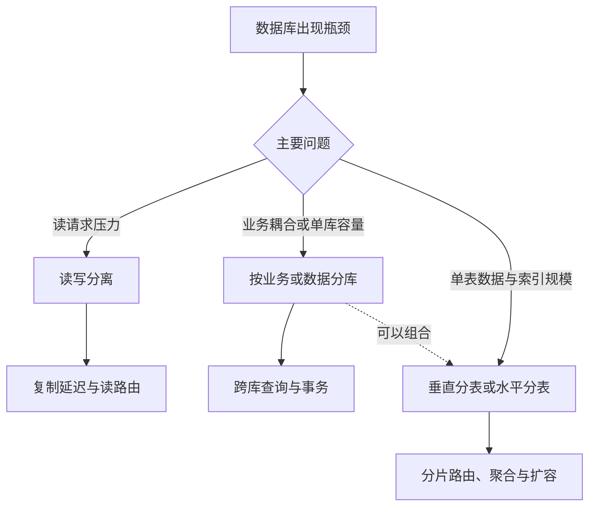
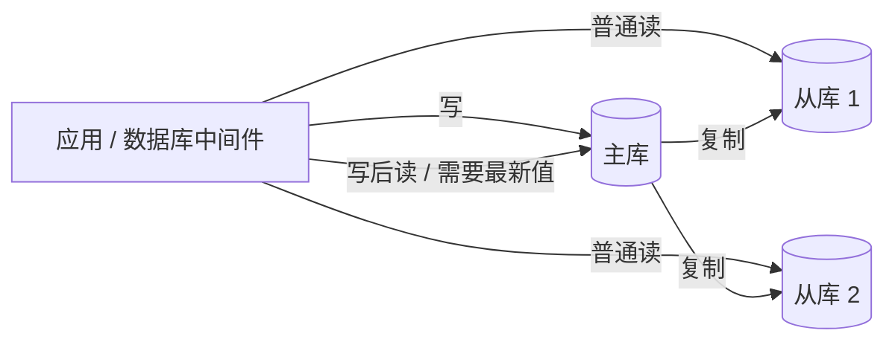

# 数据库高性能架构：读写分离与分库分表

读写分离、分库和分表解决的是不同瓶颈：**读写分离主要扩展读取能力，分库分散业务和单库压力，分表控制单表数据与索引规模**。它们可以独立使用，也可以组合使用，并不存在固定的升级顺序。

## 先判断瓶颈在哪里

| 方案 | 主要目标 | 是否通常保存全量数据 | 新增复杂度 |
|------|----------|----------------------|------------|
| 读写分离 | 分担读请求 | 是 | 复制延迟、读路由、故障切换 |
| 分库 | 分散业务、连接、计算和存储压力 | 否 | 跨库查询、事务、运维成本 |
| 分表 | 降低单表数据量和索引规模 | 否 | 分片键、路由、聚合和扩容迁移 |

## 读写分离

典型结构是主库处理写入，从库复制数据并承担读取：

### 主从和主备的关注点不同

- **主从**：从库通常承担读流量，重点是扩展读取能力；
- **主备**：备库主要用于故障接管，平时不一定承载业务流量，重点是可用性。

两者不是绝对互斥的产品名称，判断关键是副本是否承载线上请求，以及故障时如何切换。

### 复制延迟怎么处理

MySQL 传统复制通常是异步的，也可配置半同步复制。延迟受到写入量、网络、从库执行能力和大事务影响，并不存在固定的“一秒延迟”。

| 方案 | 收益 | 代价 |
|------|------|------|
| 写后读主库 | 保证读到刚写入的数据 | 主库读压力上升，业务需识别写后读 |
| 从库未命中后回源主库 | 可处理新增数据尚未复制导致的未命中 | 无法识别旧值或延迟删除；大量回源可能冲击主库 |
| 关键业务固定读主库 | 规则清晰，适合强一致业务 | 放弃部分读扩展能力 |
| 等待复制位点 / 一致性令牌 | 更精确地保证“读己之写” | 实现复杂，增加等待延迟 |

### 路由逻辑放在哪里

| 方案 | 优点 | 缺点 |
|------|------|------|
| 业务代码 / SDK | 实现简单、便于业务定制 | 多语言重复建设，配置和切换可能侵入业务 |
| 数据库中间件 / Proxy | 跨语言复用，屏蔽路由和故障切换 | 多一个网络组件和运维对象 |

业务规模较小时，代码或成熟 SDK 往往更经济；多个系统、多个语言都要复用同一套规则时，中间件的价值才更明显。

## 分库与分表

### 分库：拆开数据库边界

可以按业务（用户库、订单库、商品库）或按数据范围拆分。它能分散连接、计算、I/O 和存储压力，也能提高业务隔离性；代价是跨库 Join、跨库事务和全局约束更难处理。

分布式事务能解决部分一致性问题，但会增加协议交互、延迟和故障状态。优先通过业务边界减少跨库事务，再决定是否引入强一致协议。

### 分表：拆开单表数据

| 类型 | 拆分方式 | 典型用途 | 主要代价 |
|------|----------|----------|----------|
| 垂直分表 | 按字段拆分 | 将大字段、低频字段移出核心表 | 查询可能需要再次关联 |
| 水平分表 | 按行拆分 | 单表数据和索引过大，需要分散读写 | 需要分片键和路由算法 |

分表不一定意味着部署到多台机器。如果瓶颈只是单表索引和数据组织，同库分表也可能有效。

## 水平分表如何找到数据

| 路由方式 | 优点 | 缺点 |
|----------|------|------|
| 范围路由 | 规则直观，新增区间时通常无需重分布历史数据 | 容易出现冷热不均和写热点 |
| 哈希 / 取模 | 数据分布通常更均匀 | 节点数量变化时迁移困难 |
| 路由表 | 映射灵活，便于定向迁移 | 增加路由查找；远程查询或缓存未命中时会增加延迟，路由数据还需高可用 |
| 一致性哈希 | 节点变化时减少数据迁移范围 | 实现和均衡更复杂，常需虚拟节点 |

分片键必须来自主要查询路径。如果请求无法携带分片键，就可能需要广播查询所有分片，性能和实现复杂度都会明显上升。

## 拆分之后的新问题

- **跨库 Join**：应用层聚合、数据冗余，或交给搜索和分析系统；
- **聚合统计**：分别查询分片后汇总，或维护汇总表并接受一致性成本；
- **全局唯一 ID**：不能无协调地依赖各分片本地自增，可采用步长与偏移、号段、中心序列、UUID 或雪花算法；
- **分页排序**：跨分片排序和深分页开销显著增加；
- **扩容迁移**：通常需要历史数据迁移、增量同步或双写，以及校验、切流和回滚方案；
- **分布式事务**：需要在一致性、性能和可用性之间做权衡。

## 什么时候不要拆

不存在通用的“千万行”或“五千万行”拆分标准。是否拆分取决于数据大小、索引、SQL、查询模式、硬件和延迟目标。

在采用分库分表前，应先确认瓶颈是否能通过索引、SQL、表结构、连接池、缓存、读副本或硬件解决。分库分表成本高且难回退，不应只因为“未来可能增长”而提前采用。

