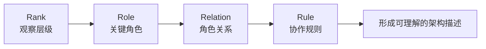
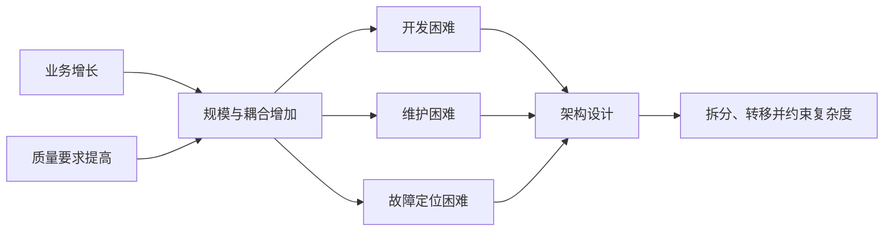

# 软件架构基础：4R 与核心概念

软件架构是软件系统的**顶层结构与关键决策集合**：系统中有哪些重要角色、角色如何协作、必须遵守哪些约束，以及系统如何应对性能、可用性和演进等长期问题。

架构设计不是画一张图，也不是堆叠热门技术。它的核心价值，是在业务目标和现实约束下**管理系统复杂度**。

## 先分清几个基础概念

| 概念 | 含义 | 主要关注点 |
|------|------|------------|
| 系统 | 相互关联的个体按照规则协作，共同完成单个体无法完成的目标 | 整体目标与协作规则 |
| 子系统 | 从某一观察层级看，属于更大系统的一部分 | 相对边界 |
| 模块 | 对代码或业务职责进行逻辑划分 | 职责、内聚与依赖 |
| 组件 | 可组合、可替换或可复用的实现单元 | 接口、复用与交付形态 |
| 框架 | 提供控制流程、扩展点和协作规范的开发基础 | 如何开发与集成 |
| 架构 | 描述系统关键组成、关系、规则和约束的顶层设计 | 系统如何组织与演进 |

“模块偏逻辑、组件偏物理”可以帮助入门理解，但不是绝对定义。一个单元究竟被称为模块还是组件，仍取决于讨论层级和团队语境。

## 用 4R 描述一套架构

| 维度 | 要回答的问题 | 示例 |
|------|--------------|------|
| Rank | 当前从哪个层级观察系统 | 企业、系统、服务、模块 |
| Role | 这一层有哪些关键角色 | 用户、网关、服务、数据库 |
| Relation | 角色之间如何连接和依赖 | HTTP 调用、消息通信、数据复制 |
| Rule | 角色如何共同完成业务 | 请求流程、故障处理、一致性规则 |

4R 是一种便于描述和检查架构的分析框架，不是唯一或强制的行业标准。它的价值在于提醒我们：架构图上的“方块”只是角色，只有补上观察层级、连接关系和运行规则，架构描述才完整。

## 为什么需要架构设计

系统复杂度主要来自两方面：

1. **业务复杂度**：业务规则、协作关系和变化速度不断增加。
2. **技术复杂度**：高性能、高可用、可扩展性和低成本等目标往往相互制约。

架构无法消除全部必要的业务复杂度，但可以通过删除无效抽象、简化流程来减少偶然复杂度，并将剩余复杂度拆分或转移到更适合的位置。例如，引入缓存降低数据库压力，却增加一致性问题；引入微服务提高独立演进能力，却增加网络调用和运维成本。

## 判断一套架构是否合理

- 是否解决了真实业务问题，而不是为了使用某项技术；
- 关键角色、关系和规则是否清晰；
- 收益是否覆盖新增的开发、测试和运维成本；
- 是否符合当前团队能力和业务规模；
- 是否保留了必要的演进空间，同时避免过度设计。

