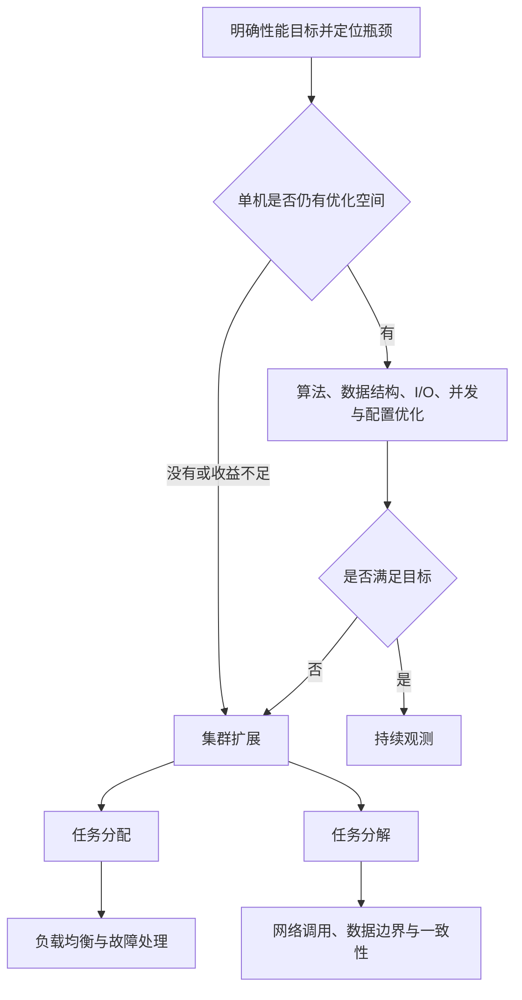

# 高性能架构：单机优化与集群扩展

高性能架构的本质，是在明确的延迟、吞吐量和并发目标下，找到当前瓶颈并突破它。每突破一次瓶颈，通常都会引入并发、多核、集群、数据拆分或缓存等机制，因此高性能往往伴随着更高的通信、调度、一致性和运维复杂度。

## 先明确“性能”指什么

| 系统类型 | 常见关注指标 |
|----------|--------------|
| 在线系统 | 平均延迟、P95/P99 延迟、并发量、错误率 |
| 批处理系统 | 吞吐量、任务完成时间 |
| 计算密集型系统 | CPU 利用率、并行效率 |
| I/O 密集型系统 | I/O 等待、连接数、并发处理能力 |

没有性能目标和测量数据，就无法判断“优化”是否有效。性能结论应来自压测、监控和真实负载，而不是仅凭数据量或机器数量推断。

## 两条主要路径

### 单机优化

单机优化的目标是充分利用现有 CPU、内存、磁盘和网络资源：

| 优化方向 | 常见手段 | 随之而来的复杂度 |
|----------|----------|------------------|
| 减少计算量 | 改进算法、数据结构、预计算 | 内存占用、实现难度 |
| 提高并发 | 进程、线程、协程 | 调度、同步、死锁、上下文切换 |
| 减少 I/O 等待 | 非阻塞 I/O、I/O 多路复用、异步 I/O | 状态管理、事件驱动、错误处理 |
| 利用多核 | 多线程、多进程、任务并行 | 数据竞争、锁竞争、缓存一致性 |
| 改善内存访问 | 亲和性、分片、NUMA 感知 | 数据布局和调度更加复杂 |

现代 CPU 通常包含多个物理核心，每个核心还可能通过 SMT / 超线程暴露多个逻辑处理器。多个逻辑处理器可以并发推进多个指令流，但共享物理核心的执行资源，其能力不等同于增加物理核心。

### 集群扩展

当单机已接近资源上限，或继续优化的成本过高，就需要将工作分散到多台机器。

- **任务分配**：把完整请求分发到不同服务器执行，典型方案是负载均衡。
- **任务分解**：把大任务拆成多个子任务或子系统，使它们可以并行执行或独立扩容。

任务分解能让瓶颈更容易定位，也能针对热点单独扩容；代价是跨系统调用增多，并引入超时、重试、一致性、故障传播和链路观测问题。

## 处理器架构中的几个术语

| 术语 | 核心特点 | 需要注意的复杂度 |
|------|----------|------------------|
| SMP | 多个处理器共享一致的内存访问视图 | 共享资源竞争、缓存一致性 |
| NUMA | 内存访问速度取决于 CPU 与内存所在节点 | 跨节点访问成本、线程和内存亲和性 |
| MPP | 多个相对独立的处理单元协同完成任务 | 数据分布、节点通信、任务协调 |

MPP 更常用于描述由多个独立节点组成的大规模并行系统，不宜简单等同于普通单服务器多核架构。

## 优化决策顺序

1. 明确业务目标：要优化延迟、吞吐量还是并发容量；
2. 建立观测：CPU、内存、I/O、网络、锁等待和下游耗时；
3. 定位真实瓶颈，而不是凭经验猜测；
4. 先选择复杂度最低且能满足目标的方案；
5. 通过压测验证收益和副作用；
6. 达到单机收益边界后，再考虑集群和系统拆分。

## 关键认识

- 架构只是性能上限的重要影响因素之一；算法、数据结构、硬件、运行时、配置和负载模型同样可能决定上限。
- 系统不是拆得越细越好，跨进程、跨机器调用通常比进程内调用昂贵。
- 性能提升是在“收益”和“新增复杂度”之间做交易，收益不能覆盖成本时，应保持简单或只做局部优化。

