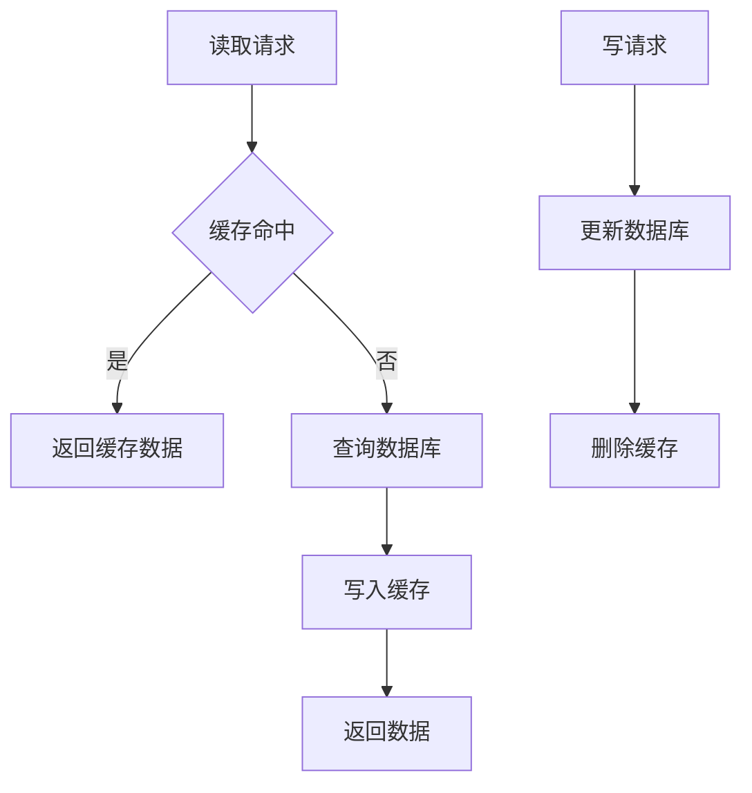
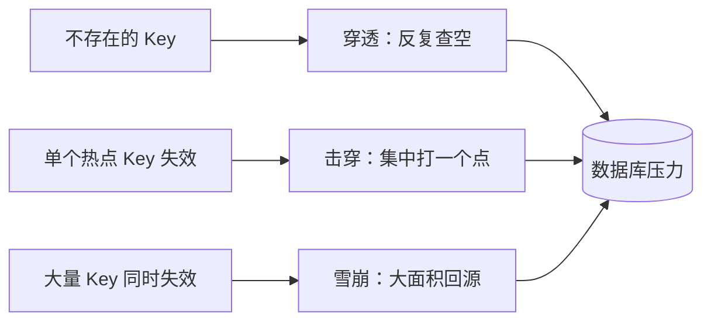
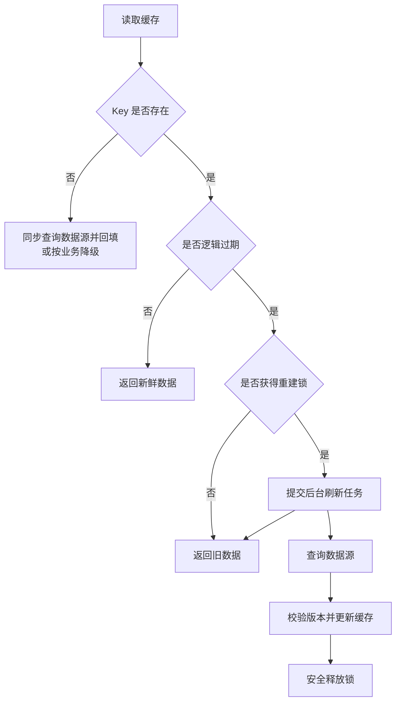
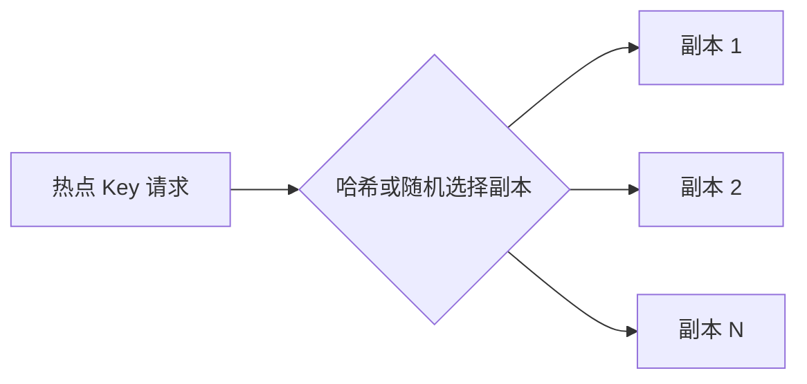

# 高性能缓存架构：穿透、击穿、雪崩、热点 Key 与大 Key

缓存把高频访问或计算成本高的数据放到更快的存储层，减少数据库和下游系统的重复工作。它特别适合读多写少、热点明显或允许短暂不一致的场景，但性能收益背后会增加一致性、失效重建、容量淘汰和热点治理等问题。

## 哪些场景值得缓存

- **复杂计算可复用**：聚合统计、推荐结果等重复计算成本高；
- **读远多于写**：一次写入对应大量查询，即使有索引也可能承受不了峰值；
- **热点明显**：少量数据承担大部分请求；
- **需要保护下游**：避免数据库和远程服务直接面对全部流量。

缓存通常不是数据的唯一事实来源，也不能修复低效算法和无边界查询。只有缓存命中带来的收益大于维护成本，并且业务能接受相应的一致性模型时，才值得引入。

## 最常见的 Cache Aside



常见做法是“读时回填，写时先更新数据库再删除缓存”。它通常以最终一致性为目标，但必须配合有限 TTL、删除重试、CDC / 变更通知或其他补偿机制才能保证最终收敛。

一个典型并发窗口是：读请求先查到数据库旧值，写请求随后更新数据库并删除缓存，而先前的读请求最后又把旧值回填到缓存。如果没有 TTL、版本校验或后续失效通知，旧值可能长期存在。

## 穿透、击穿和雪崩不是同一个问题

| 问题 | 数据状态 | 发生原因 | 常见方案 |
|------|----------|----------|----------|
| 缓存穿透 | 缓存和数据库都不存在 | 无效或恶意请求持续查询不存在的 Key | 参数校验、缓存空值、布隆过滤器、限流 |
| 缓存击穿 | 数据库存在，通常还是热点数据 | 单个热点 Key 失效，大量请求同时重建 | 互斥重建、逻辑过期、后台刷新 |
| 缓存雪崩 | 通常存在大量有效数据 | 大量 Key 同时失效或缓存服务整体不可用 | 过期时间加随机值、多级缓存、高可用、限流降级 |



记忆方式：**穿透是查无此物，击穿是热点失效，雪崩是大量缓存一起倒下。**

## 缓存失效后怎么重建

### 互斥重建

只允许一个请求查询数据库并重建缓存，其他请求等待、快速失败或返回旧值。

- 单机可以使用本地锁；
- 多实例需要分布式锁或等效的互斥机制；
- 锁必须有超时，并处理持有者异常退出；
- 请求等待时间和数据库保护之间需要权衡。

### 逻辑过期与后台刷新

逻辑过期不是 Redis 自带的过期机制，而是应用把业务数据和逻辑过期时间一起存入缓存。Redis Key 可以保留较长的物理 TTL，或者不设置物理 TTL；应用读取时自行判断 `expireAt`：

```json
{
  "data": { "id": 1001, "name": "商品 A" },
  "expireAt": 1790208000,
  "version": 42
}
```

典型读取流程：



这类模式也常被称为 **stale-while-revalidate**：读取线程即使发现数据过期，也先返回旧值；只有一个执行者在后台刷新，从而避免热点 Key 失效时大量请求同时访问数据库。

实现时需要注意：

1. **冷启动不能只返回旧值**：Key 完全不存在时没有旧数据可用，需要同步加载、预热或降级。
2. **重建锁要有超时和唯一标识**：使用类似 `SET lock value NX PX` 的方式，并只释放自己持有的锁，避免死锁或误删他人的锁。
3. **加锁后再次检查**：刷新任务获得锁时，其他任务可能已经更新缓存，应再次检查逻辑过期时间，避免重复重建。
4. **后台任务池必须有界**：刷新请求过多时要合并、限流或丢弃低优先级任务，避免后台刷新反过来拖垮应用和数据库。
5. **旧数据不能无限返回**：除逻辑过期时间外，还应设置最大陈旧时间、兜底物理 TTL 或失败告警，防止刷新持续失败后永久返回旧值。
6. **防止旧结果覆盖新结果**：更新频繁时可使用版本号、时间戳或 CAS / Lua 校验，只允许较新的结果写入。

后台刷新可以由三种方式触发：

| 方式 | 工作机制 | 适用场景 | 主要限制 |
|------|----------|----------|----------|
| 请求触发 | 第一个发现逻辑过期的请求提交刷新任务 | 热点访问稳定、希望按需刷新 | 无访问时不会刷新；突发访问需要互斥 |
| 定时刷新 | 定时任务在过期前主动更新 | 热点集合可预测、刷新周期稳定 | 可能刷新无人访问的数据 |
| 事件驱动 | 数据变更后通过消息队列或 CDC 更新 / 失效缓存 | 数据更新事件明确、希望更及时 | 消息延迟、重复和丢失需要补偿 |

逻辑过期的代价是允许短暂旧数据，因此不适合余额、库存扣减等要求严格实时正确性的读取。

### 消息通知和预热

- 缓存缺失时发送消息，由后台消费者去重后重建；
- 系统上线或活动开始前主动加载可预测的热点；
- 恶意遍历和爬虫应在接入层识别、限流和封禁，不能只靠缓存解决。

## 热点 Key 与大 Key

热点 Key 和大 Key 是两个不同维度的问题：

| 问题 | 判断维度 | 主要风险 |
|------|----------|----------|
| 热点 Key | 访问频率或并发量异常高 | 单分片 CPU / 网络被打满、延迟上升、故障集中 |
| 大 Key | 单个 Value 的字节数或集合元素数异常大 | 内存倾斜、单命令耗时、传输阻塞、复制和迁移变慢 |

它们可能同时出现：一个既大又热的 Key，会同时放大访问压力和单次操作成本。

### 热点 Key 怎么处理



- 把读取极热、更新较少的数据复制为多个 Key，随机或按哈希读取；
- 副本过期时间错开，避免同时失效；
- 使用本地缓存或多级缓存，减少对 Redis 的访问；
- 合并同一 Key 的并发请求，控制回源和重建次数；
- 热点无法拆散时，可隔离到独立实例或分片并单独扩容。

多副本会增加更新和一致性成本，不适合更新频繁的数据。`redis-cli --hotkeys` 可以辅助识别热点，但只有 `maxmemory-policy` 使用 LFU 策略时才有效；结果是 LFU 频率估计，不是精确实时 QPS，还应结合应用监控、代理层统计和 Redis 实例指标判断。

### 大 Key 为什么危险

“大”没有统一字节或元素阈值，应结合命令复杂度、网络带宽、延迟目标和实例规模判断。常见影响包括：

- 单个 Key 占用大量内存，造成集群分片内存倾斜；
- `HGETALL`、`LRANGE 0 -1`、`SMEMBERS` 等全量操作返回大量数据，阻塞事件循环和网络传输；
- 同步删除大 Key 可能花费较长时间；
- RDB、AOF 重写、主从复制、集群迁移和故障恢复成本上升；
- 一个大集合上的高复杂度操作可能形成延迟尖刺。

### 如何识别大 Key

```bash
redis-cli --bigkeys             # 按逻辑长度 / 元素数查各类型大 Key
redis-cli --memkeys             # 按估算内存占用查大 Key
MEMORY USAGE key                # 查看指定 Key 的内存占用
```

- `--bigkeys` 使用 `SCAN` 遍历，String 看字节数，集合类型看元素数；它不等于精确内存统计。
- `--memkeys` 更关注内存字节数，复杂结构可能采用采样估算。
- 两者都可能扫描很久并增加生产实例负载，可通过 `--pattern` 缩小范围、用 `-i` 节流，并优先在副本或低峰期执行。
- 不要使用 `KEYS *` 在生产环境全量查找大 Key。

### 如何治理大 Key

1. **拆分数据**：将大 Hash、List、Set 或 ZSet 按业务维度、时间或哈希拆成多个 Key。
2. **避免全量操作**：使用 `HSCAN`、`SSCAN`、`ZSCAN`，或限制分页范围；不要一次取回整个大集合。
3. **控制单个 Value**：大 JSON / 二进制对象可拆字段、压缩，或把主体放到对象存储，仅缓存索引和摘要。
4. **异步删除**：优先评估 `UNLINK`，让内存回收在后台完成；删除超大集合也可分批渐进处理。
5. **从设计入口限制增长**：设置单对象大小、集合元素数和保留周期的业务上限，并对接近阈值的 Key 告警。
6. **观察分片倾斜**：不仅看总内存，还要比较各节点内存、网络、延迟和 Key 分布。

## 数据一致性怎么权衡

| 方案 | 一致性特点 | 复杂度 | 适用场景 |
|------|------------|--------|----------|
| 较短 TTL | 最终一致 | 低 | 可容忍短暂旧数据 |
| 更新数据库后删除缓存 | 最终一致 | 中 | 通用 Cache Aside |
| 消息队列 / CDC 驱动失效 | 最终一致、可重试补偿 | 较高 | 多系统共享缓存、变更链路复杂 |
| 写穿 / 写回缓存 | 取决于具体实现 | 高 | 需要统一缓存写入入口的特定系统 |

不存在同时保证零延迟、绝对一致、无限容量和低实现成本的缓存方案。选型时应先明确：允许旧数据存在多久、缓存故障时如何降级、数据库能承受多少回源流量。

## 需要持续观察的指标

- 命中率与回源请求量；
- 热点 Key 的访问频率、大 Key 的元素数与内存占用；
- 缓存延迟、错误率与连接数；
- 淘汰数量和内存使用率；
- 缓存重建耗时与失败率；
- 数据库在缓存故障时的保护效果。

