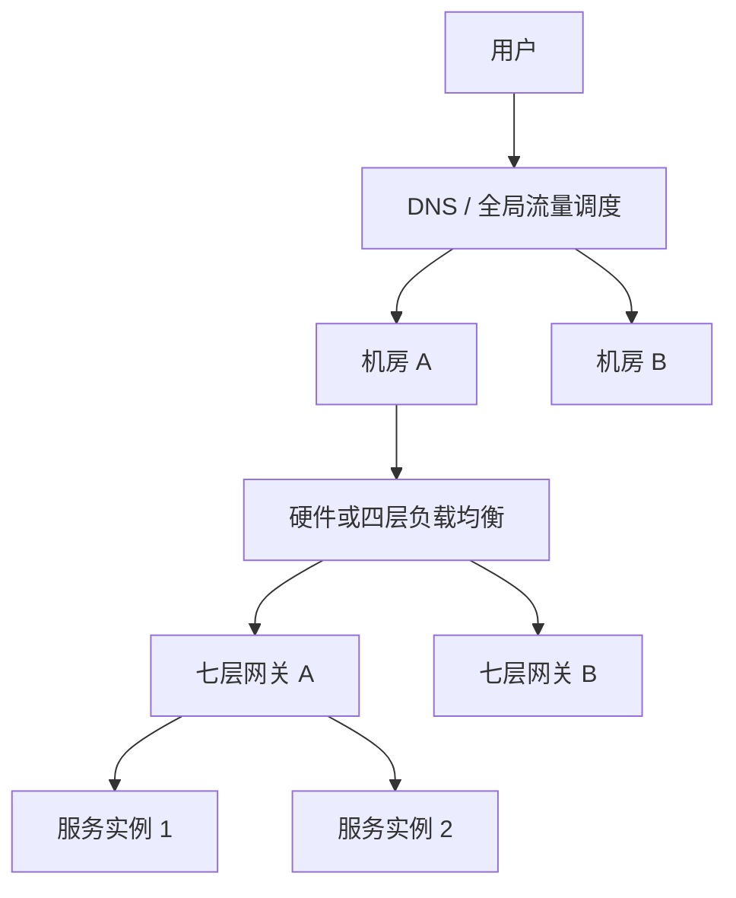
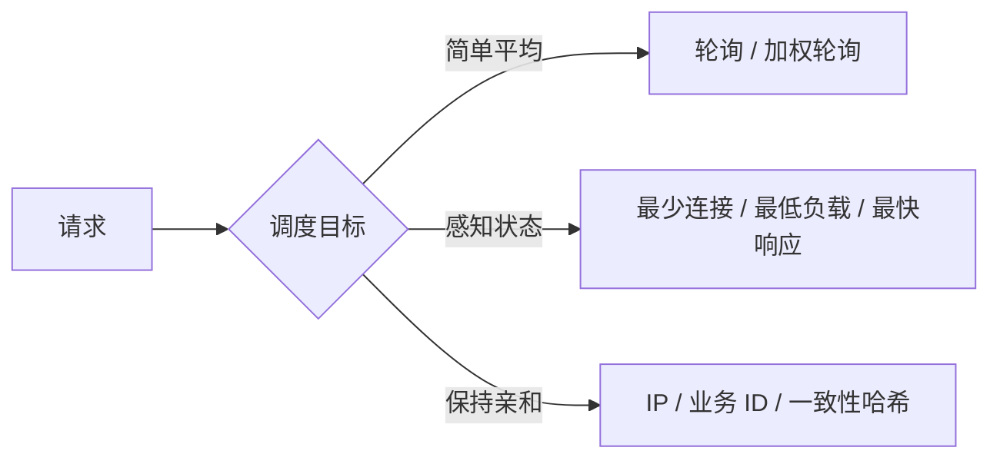

# 高性能集群：负载均衡层级与算法

集群通过增加服务器突破单机容量，负载均衡负责把请求送到合适的节点。真正的难点不只是“把流量平均分掉”，还包括节点发现、健康检查、会话状态、失败重试，以及负载均衡器自身不能成为单点。

## 负载均衡到底在均衡什么

负载均衡是任务分配的一种常见形式，分配目标可以不同：

- 尽量平均请求数量；
- 优先使用空闲或响应更快的节点；
- 根据地域选择更近的机房；
- 将同一会话或业务标识固定到同一节点；
- 避开故障、过载或正在下线的节点。

所以“负载均衡”不等于每台机器的 CPU 必须完全相同，而是根据业务目标选择合适的分配策略。

## 从用户到服务实例的分层调度

| 层级 | 常见实现 | 擅长什么 | 主要限制 |
|------|----------|----------|----------|
| DNS / 全局层 | DNS、GSLB | 跨地域调度、就近访问 | 缓存导致切换不及时，调度粒度较粗 |
| 硬件层 | F5、A10 | 高性能、高稳定性、网络与安全能力 | 价格高、业务定制受限 |
| 软件四层 | LVS 等 | 基于 IP/端口高效转发 | 不理解 HTTP 路径、Header 等业务语义 |
| 软件七层 | Nginx、HAProxy、Envoy 等 | 按域名、路径、Header 灵活路由 | 应用层处理带来更多资源开销 |

这些层级不是互斥关系。大型系统可以让 DNS 负责地域级调度，四层负载均衡负责连接转发，七层网关负责业务路由。

DNS 可以返回任意服务地址，并非只能调度到不同机房；但受缓存、控制粒度和后端状态感知能力限制，它通常更适合全局流量调度。

## 调度算法怎么选

| 算法 | 决策依据 | 适合什么场景 | 主要局限 |
|------|----------|--------------|----------|
| 轮询 | 按顺序分配 | 节点能力、请求成本近似 | 无法感知实时状态差异 |
| 加权轮询 | 按权重分配 | 新旧机器或配置不同 | 权重设置不准时仍会失衡 |
| 最少连接 | 当前连接数 | 长连接或请求耗时差异较大 | 连接数不一定代表实际负载 |
| 最低负载 | CPU、I/O、队列长度等 | 需要动态感知节点状态 | 指标采集、上报和决策复杂 |
| 最快响应 | 近期响应时间 | 直接关注用户体验 | 采样窗口影响准确性，也会增加监控开销 |
| 哈希 | IP、Session ID、业务 ID | 会话亲和、本地状态复用 | 节点变化会改变映射，可用一致性哈希缓解 |

规模较小时，轮询或加权轮询通常已经足够；只有简单算法无法满足目标时，才值得引入实时负载采集和复杂调度。

## 生产环境还需要哪些能力

1. **服务发现**：持续获取可用节点列表；
2. **健康检查**：摘除故障节点，恢复后重新加入；
3. **超时与重试**：避免无限等待，同时防止重试风暴；
4. **会话管理**：优先将服务设计为无状态，确有需要再使用会话亲和；
5. **负载均衡器高可用**：避免流量入口成为单点；
6. **连接排空**：节点下线前停止接收新请求，并处理已有连接；
7. **可观测性**：监控请求量、延迟、错误率、节点负载和摘除情况。

## 常见误区

- **负载均衡不会减少请求本身的计算量**，但路由到更空闲、更快或更近的节点，可以减少排队与网络时延。
- **会话亲和不等于高可用**：绑定节点后，节点故障仍需处理会话丢失；共享会话或无状态服务通常更容易扩展。
- **重试不是越多越好**：错误重试会放大后端压力，必须配合超时、退避、熔断和重试预算。
- **产品性能数字不能照搬**：并发量取决于硬件、协议、连接持续时间、配置和业务处理成本。

